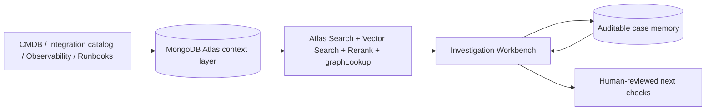

# Find the Failure

**An EDI Integration Impact Explorer** — a bounded Agent v1 PoC/demo with a
searchable, relationship-aware context layer over an integration landscape. It
answers *"What's affected, who owns it, and what happens next?"* in seconds
instead of hours.

> MongoDB does not replace existing integration engines (e.g. Apex Health Supply's). It
> gives architects a flexible, searchable context layer **above** them so they
> can understand how the landscape fits together.

For a step-by-step presenter walkthrough, see [`DEMO.md`](./DEMO.md). For future
changes, use the lightweight spec workflow in [`specs/`](./specs/).

> **Positioning:** this repository is an early-stage, seeded PoC. It demonstrates
> the operating model and MongoDB fit; production readiness still requires real
> source ingestion, SME-validated truth data, security/governance controls, and
> scale testing.

---

## Recommended demo path

The **Investigation Workbench** is the hero experience. Use the other tabs as
supporting views only when the audience wants to go deeper.

1. Start from an operational alert in the Workbench.
2. Show how MongoDB maps the alert to a canonical interface and dependency graph.
3. Explain business-process impact, accountable owners, and related runbooks.
4. Open the MongoDB trace to prove each agent stage is grounded in real queries.
5. Close with persisted case memory and human-reviewed next checks.

Supporting views:

- **Presenter Console** — scripted walkthrough and reset-friendly demo controls.
- **Catalog Explorer** — the underlying systems, interfaces, owners, and graph.
- **Context Ingestion** — how raw CMDB/inventory/observability records become trusted context.
- **Modernization** — the same graph used for change-planning impact analysis.

---

## Architecture at a glance



MongoDB is the context layer: flexible documents capture heterogeneous integration
metadata, typed relationships support graph traversal, Atlas Search and optional
Vector Search retrieve operational knowledge, and investigation cases preserve
auditable memory.

---

## Features

- **Search** across systems, interfaces, protocols, business terms, and owners —
  powered by **Atlas Search** (fuzzy + relevance-ranked), with a regex fallback.
- **Dependency graph** — traverse upstream/downstream relationships with
  `$graphLookup`, rendered as an interactive React Flow diagram.
- **Impact analysis** — simulate a failure and instantly see the failed
  interface, downstream systems at risk, responsible owner, runbook, and similar
  recent failures.
- **Modernization what-if** — "What breaks if we replace this system?" returns
  affected interfaces, owners to coordinate, and migration dependencies.
- **Agent v1 Investigation Workbench** — alert-first supervised workflow with
  topology mapping, related runbook/incident retrieval, evidence, likely
  fault-domain ranking, grounded follow-up, case memory, a grouped investigation
  playbook, local alert lifecycle tracking, a guided enterprise context replay
  path, and collapsed secondary demo controls.
- **Enterprise fixture ingestion** — optional Alertmanager, integration-catalog,
  and CMDB-style records are captured as raw source evidence, resolved to
  canonical keys, normalized into events/relationships, surfaced in the
  Workbench inbox, and scored for trust.

---

## Tech stack

| Layer | Technology |
|---|---|
| Backend | Node.js + Express + Mongoose (`backend/`) |
| Frontend | React + Vite + React Flow (`frontend/`) |
| Database | MongoDB Atlas Local (mongod + Atlas Search) via `docker-compose.yml` |

---

## Prerequisites

- Node.js 18+ and npm
- Docker (for the MongoDB Atlas Local container)

---

## Quick start

Copy the example config first, then pick a mode:

```bash
cp .env.example .env
```

### Option A — Local (Docker)

```bash
npm run demo
```

This starts MongoDB Atlas Local, installs dependencies, seeds the data, and
launches the backend (`:4000`) and frontend (`:5173`).

Then open **http://localhost:5173**.

- Stop servers: `Ctrl+C`
- Stop the database: `npm run stop`
- Re-seed the database: `npm run seed`

### Option B — MongoDB Atlas (cloud, no Docker)

Set `MONGO_URI` in `.env` to your Atlas SRV string (see
[Using MongoDB Atlas](#using-mongodb-atlas)), then:

```bash
npm run start:app
```

This installs dependencies, seeds the data, and launches backend + frontend —
**without** starting a local database container.

### Manual start

```bash
docker compose up -d            # local only — start MongoDB Atlas Local
cd backend && npm install && npm run seed && npm start
cd ../frontend && npm install && npm run dev
```

---

## Configuration

All configuration lives in a single **centralized `.env` at the repository root**.
Start from [`.env.example`](./.env.example), which documents both modes:

```
MONGO_URI=mongodb://localhost:27017/find_the_failure?directConnection=true
PORT=4000
ATLAS_RETRIEVAL_MODE=atlas-search
ENABLE_ATLAS_AUTO_EMBED_INDEX=false
```

It is loaded by `backend/src/config.js` (resolved relative to the module, so it
works regardless of the working directory). `directConnection=true` is required
because Atlas Local runs as a single-node replica set.

### Using MongoDB Atlas

To run against a cloud Atlas cluster instead of the local Docker container:

1. Create a cluster (the free **M0** tier works and includes Atlas Search).
2. Add a **database user** and allow your IP under **Network Access**.
3. Set `MONGO_URI` in `.env` to the cluster's SRV string, keeping the
   `/find_the_failure` database name and **omitting** `directConnection`:

   ```
   MONGO_URI=mongodb+srv://<USER>:<PASSWORD>@<cluster>.xxxxx.mongodb.net/find_the_failure?retryWrites=true&w=majority
   ```

4. Start without Docker: `npm run start:app`.

No code changes are needed — `ensureSearchIndexes()` creates the Atlas Search
indexes on your cluster on first startup. The `.env` is git-ignored, so
credentials stay out of version control; keep the URI in `.env` only (not in
shell commands, logs, or tickets).

### Related-context retrieval modes

The Investigation Workbench searches `operational_knowledge` for related
runbooks, incident notes, and business context. The default is Atlas Search with
a local keyword fallback.

- `ATLAS_RETRIEVAL_MODE=atlas-search` — default, no AI service required.
- `ATLAS_RETRIEVAL_MODE=atlas-rerank` — Atlas Search candidates + `$rerank`.
- `ATLAS_RETRIEVAL_MODE=vector-rerank` — Automated Embedding `$vectorSearch` + `$rerank`.
- `ATLAS_RETRIEVAL_MODE=auto` — try vector/rerank first, then fall back.

Set `ENABLE_ATLAS_AUTO_EMBED_INDEX=true` only on an Atlas project where
Automated Embedding and Native Reranking are enabled and expected. It creates a
`vectorSearch` index over `operational_knowledge.text` using the `autoEmbed`
field type.

---

## Data model (10 collections)

`systems`, `interfaces`, `data_entities`, `owners`, `events`,
`business_processes`, `relationships`, `source_records`, `operational_knowledge`, and
`investigation_cases`.

The `interfaces` collection uses a flexible schema so a single model can hold
EDI, REST, FHIR, event, and SFTP interfaces. Seeded footprint: **9 systems,
10 interfaces, 3 owners, 4 data entities, 2 business processes, 17 typed
relationships, and 5 source records**. The Context Ingestion tab and Workbench
can optionally load **7 enterprise fixture records** from Alertmanager, integration-catalog,
and CMDB-style exports, then normalize them into additional relationship/event
evidence with provenance. Two of those records are external Alertmanager alerts
that appear in the Workbench inbox. The Workbench can also targeted-upsert **4
additional simulated observability alerts**, retrieve **8 operational knowledge
documents**, and persist investigation cases.

---

## API

Base URL: `http://localhost:4000/api`

| Method | Path | Purpose |
|---|---|---|
| GET | `/health` | Liveness check |
| GET | `/search?q=` | Cross-collection Atlas Search (regex fallback) |
| GET | `/interfaces` · `/interfaces/:key` | List / full interface detail |
| GET | `/flow/:key` | Dependency graph (nodes + edges) |
| GET | `/impact/:key` | Downstream impact + owners + similar failures |
| POST | `/simulate/:key` | Inject a failure |
| POST | `/reset` | Restore pristine demo state |
| GET | `/scenarios` · POST `/scenarios/:id/run` | Named failure scenarios |
| GET | `/modernization/:systemKey` | What-if impact of replacing a system |
| GET | `/ingestion` · GET `/ingestion/quality` | Source records, pipeline, quality, provenance score |
| POST | `/ingestion/fixtures` | Load optional enterprise fixture pack |
| POST | `/ingestion/run` | Normalize source records into relationships/events |
| POST | `/ingestion/fixtures/clear` | Remove optional fixture pack and normalized fixture evidence |
| GET | `/alerts` | List observability alerts imported as source records |
| POST | `/alerts/demo-feed` | Target-upsert simulated alert feed records |
| POST | `/alerts/:sourceRecordKey/lifecycle` | Update local Workbench alert lifecycle status |
| GET/POST | `/cases` · `/cases/investigate/:sourceRecordKey` | Persist and list investigation cases |
| POST | `/workbench/clear-demo-state` | Clear simulated feed alerts, lifecycle state, and case memory |
| GET | `/systems` · `/owners` | Listings |

---

## Project structure

```
Find_The_Failure/
├── .env                  # centralized config (git-ignored)
├── .env.example          # config template (local + Atlas)
├── docker-compose.yml    # MongoDB Atlas Local
├── package.json          # root scripts: demo, start:app, seed, stop
├── scripts/
│   ├── demo.sh           # local launcher (starts Docker DB)
│   └── app.sh            # Atlas launcher (no Docker)
├── DEMO.md               # presenter runbook
├── backend/
│   └── src/
│       ├── config.js     # loads root .env
│       ├── db.js         # Mongoose connection
│       ├── models.js     # 10 collections
│       ├── routes.js     # REST API
│       ├── server.js     # Express app
│       ├── scenarios.js  # named failure scenarios
│       ├── seed/         # seed data + runner
│       └── services/     # graph, impact, search, retrieval, search index
└── frontend/
    └── src/
        ├── api.js        # API client
        ├── App.jsx       # tab shell
        └── components/   # SearchBar, DependencyGraph, InterfaceDetails,
                          # Explorer, Modernization
```

---

## Verifying the demo

```bash
npm run smoke
```

This full demo smoke test exercises the running server across search, graph,
impact, enterprise fixture ingestion, quality/provenance scoring, scenarios,
modernization, Workbench investigation, alert lifecycle, related context
retrieval, case memory, and reset/cleanup. It clears the optional fixture pack
before the Workbench path so the normal rehearsal baseline remains stable.

For the smaller backend-only check, run `cd backend && node smoke.mjs`.
